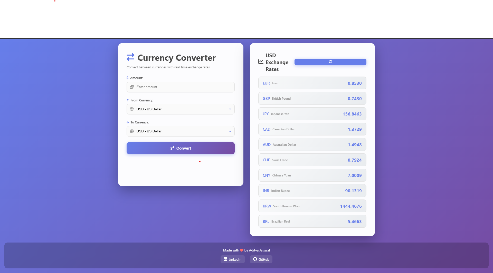

# 💱 Currency Converter by Aditya Jaiswal

A beautiful, real-time currency converter web application built with Flask and modern JavaScript. Convert between multiple currencies with up-to-date exchange rates.

  



## ✨ Features

- 💱 Real-time currency conversion
- 📊 Live exchange rates display (USD to 10 popular currencies)
- 🎨 Modern, responsive UI with smooth animations
- 🔄 Auto-refresh exchange rates
- 📱 Mobile-friendly design
- 🔒 Secure API key management using environment variables

## 🚀 Quick Start

### Prerequisites

- Python 3.8 or higher
- Exchange Rate API key (free at [exchangerate-api.com](https://www.exchangerate-api.com/))

### Local Setup

1. **Clone the repository**
   ```bash
   git clone https://github.com/yourusername/currency-converter.git
   cd currency-converter
   ```

2. **Create a `.env` file**
   ```bash
   EXCHANGE_RATE_API_KEY=your_api_key_here
   ```

3. **Install dependencies**
   ```bash
   pip install -r requirements.txt
   ```

4. **Run the application**
   ```bash
   python main.py
   ```

5. **Open your browser**
   Navigate to `http://localhost:5000`

## 🌐 Deploy to Production

### Option 1: Render (Recommended - Free)

1. **Push your code to GitHub**

2. **Sign up at [Render.com](https://render.com)**

3. **Create a new Web Service**:
   - Connect your GitHub repository
   - Build command: `pip install -r requirements.txt`
   - Start command: `gunicorn main:app`

4. **Set Environment Variable**:
   - Go to Settings → Environment
   - Add: `EXCHANGE_RATE_API_KEY` = `your_api_key_here`

5. **Deploy!** Your site will be live at `https://your-app-name.onrender.com`

### Option 2: Railway (Free Tier)

1. **Sign up at [Railway.app](https://railway.app)**

2. **Create a new project**:
   - Click "New Project"
   - Select "Deploy from GitHub repo"
   - Choose your repository

3. **Set Environment Variable**:
   - Go to "Variables" tab
   - Add: `EXCHANGE_RATE_API_KEY` = `your_api_key_here`

4. **Deploy!** Railway will provide a URL automatically

### Option 3: PythonAnywhere (Free Tier)

1. **Sign up at [PythonAnywhere.com](https://www.pythonanywhere.com)**

2. **Upload your files** via the Files tab

3. **Set Environment Variable**:
   - Go to "Web" tab → Your web app
   - In "Environment variables" section, add:
     - Key: `EXCHANGE_RATE_API_KEY`
     - Value: `your_api_key_here`

4. **Configure WSGI file** to point to `main:app`

5. **Reload** your web app

## 🔐 Security

- API keys are stored in environment variables (never committed to git)
- `.env` file is in `.gitignore`
- Always set `EXCHANGE_RATE_API_KEY` in your hosting platform's environment variables

## 📁 Project Structure

```
currency-converter/
├── main.py              # Flask backend application
├── index.html           # Frontend HTML/CSS/JavaScript
├── requirements.txt     # Python dependencies
├── Procfile            # Deployment configuration
├── .gitignore          # Git ignore rules
└── README.md           # This file
```

## 🛠️ Technologies Used

- **Backend**: Flask (Python)
- **Frontend**: HTML5, CSS3, JavaScript (Vanilla)
- **API**: ExchangeRate-API
- **Icons**: Font Awesome
- **Deployment**: Gunicorn

## 📝 API Endpoints

- `GET /` - Main application page
- `POST /convert` - Convert currency
- `GET /rates` - Get exchange rates
- `GET /sitemap.xml` - SEO sitemap
- `GET /robots.txt` - SEO robots file

## 🎯 SEO Optimized

This project is optimized for search engines with:
- Meta tags and Open Graph tags
- Structured data (JSON-LD)
- Sitemap and robots.txt
- Optimized for "currency converter by aditya" search queries

## 👤 Author

**Aditya Jaiswal**

- LinkedIn: [adityajaiswal25](https://www.linkedin.com/in/adityajaiswal25)
- GitHub: [adityajaiswal25](https://github.com/adityajaiswal25)

## 📄 License

This project is open source and available under the MIT License.

## 🙏 Acknowledgments

- Exchange Rate API for providing free currency data
- Font Awesome for icons

---

Made with ❤️ by Aditya Jaiswal

